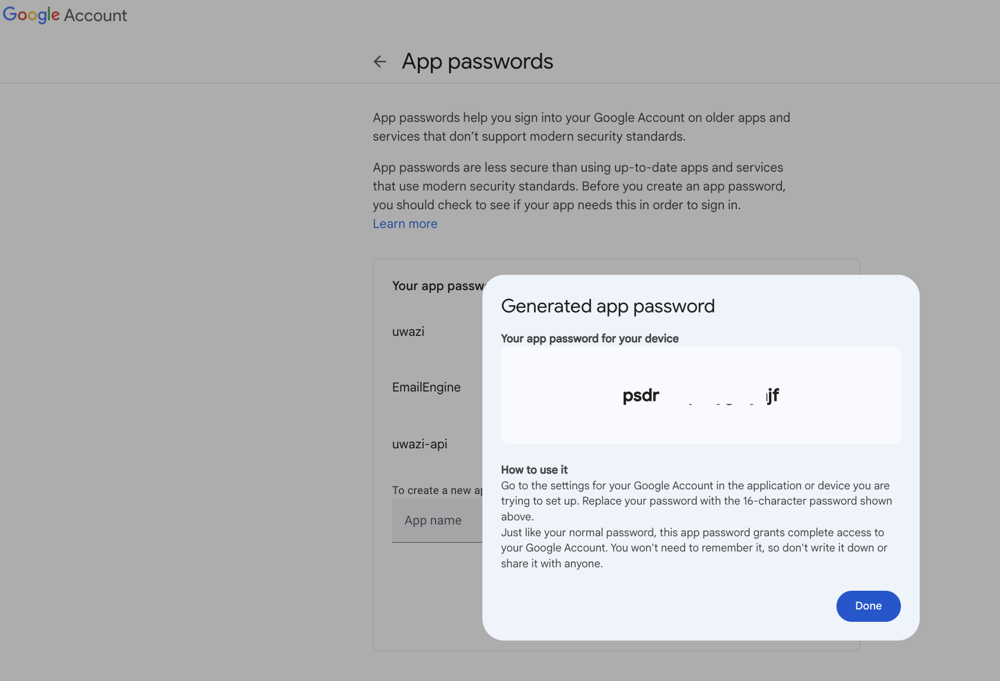
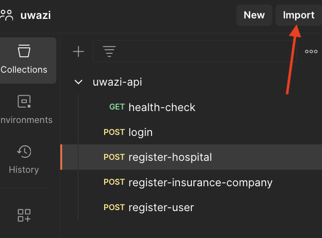
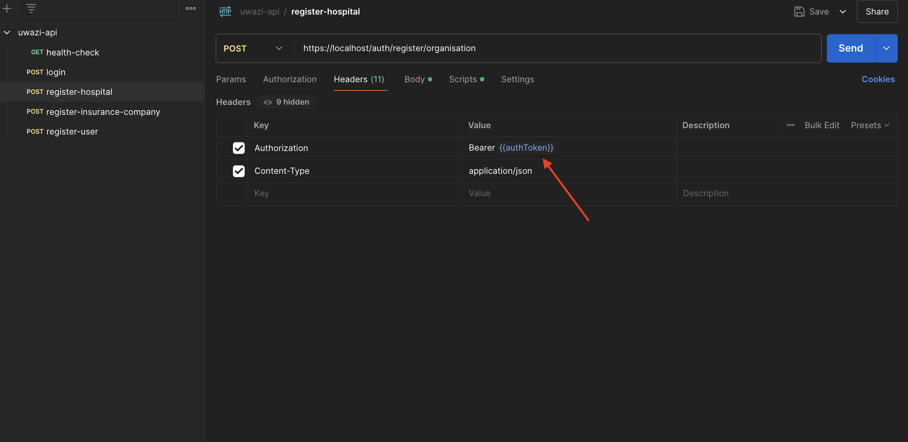

# Uwazi API

The Uwazi API helps hospital insurance providers verify if hospital insurance claims are valid or not.

---

## 1. Environment Setup

### Steps:
1. **Clone the Repository:**
   - get the github url of the repository by clicking on the code button and copy the url
   
   - Clone the branch to your local machine using the following command:
     ```bash
     git clone <github-url>
     ```

     

2. **Rename `.env.sample` to `.env`:**
   - Navigate to the root directory of the cloned repository.
   - Rename the file `.env.sample` to `.env`.

3. **Configure `.env` Variables:**
   - Open the `.env` file and configure the variables as per your environment.

---

### Explanation of `.env` Variables

#### General Configuration:
| Variable       | Description                                                             |
|----------------|-------------------------------------------------------------------------|
| `FLASK_APP`    | Entry point for the Flask application. Set to `start.py`.              |
| `FLASK_ENV`    | Flask environment. Use `development` for local development.            |
| `FLASK_PORT`   | Port where the Flask application will run. Default is `8080`.          |

#### Security Configuration:
| Variable       | Description                                                                 |
|----------------|-----------------------------------------------------------------------------|
| `SECRET_KEY`   | Secret key for securing sessions and other cryptographic uses. Use 32 bit string or use the default value in the sample file for local testing. |

#### Database Configuration:
| Variable          | Description                                             |
|-------------------|---------------------------------------------------------|
| `POSTGRES_HOST`   | Hostname for the PostgreSQL database. Default is `database`. |
| `POSTGRES_PORT`   | Port for the PostgreSQL database. Default is `5432`.    |
| `POSTGRES_DB`     | Name of the PostgreSQL database. Set to `uwazi_db`.     |
| `POSTGRES_USER`   | Username for the PostgreSQL database. Set to `uwazi_admin`. |
| `POSTGRES_PASSWORD` | Password for the PostgreSQL database. Set to `Today123%!`. |

#### Admin Configuration:
| Variable               | Description                                      |
|------------------------|--------------------------------------------------|
| `DEFAULT_ORG_NAME`     | Name of the default organization.                |
| `DEFAULT_ADMIN_EMAIL`  | Email address for the default admin user.        |
| `DEFAULT_ADMIN_PASSWORD` | Password for the default admin user.            |
| `DEFAULT_ADMIN_USERNAME` | Username for the default admin user.            |

#### Mail Configuration:
| Variable        | Description                                                                 |
|-----------------|-----------------------------------------------------------------------------|
| `MAIL_USERNAME` | gmail Username for the email account used for mailing.                           |
| `MAIL_PASSWORD` | gmail passkey for the email account used for mailing. Checkout the `Setting Up Mailing Configuration` section below                          |

---

### Setting Up Docker Desktop
1. **Install Docker Desktop:**
   - Download and install Docker Desktop from the [Docker website](https://www.docker.com/products/docker-desktop/).

2. **Start Docker Desktop:**
   - Open Docker Desktop and ensure it is running.

3. **Verify Installation:**
   - Run the following command to verify Docker is installed and running:
     ```bash
     docker --version
     ```

---

### Setting Up mkcert for HTTPS
1. **Install mkcert:**
   - Download and install `mkcert` from the [mkcert GitHub repository](https://github.com/FiloSottile/mkcert).

2. **Generate Localhost Certificates:**
   - Run the following commands to generate certificates:
     ```bash
     mkcert -install
     mkcert localhost
     ```

3. **Copy Certificates:**
   - Copy the generated `localhost-key.pem` and `localhost.pem` files to the `config/nginx/certs` directory.

4. **Test HTTPS Locally:**
   - Use `https://localhost/health` to test your application without specifying a port.
   This should return the following response:
   ```json
   {
      "status": "healthy"
   }
   ```

---

### Setting Up Mailing Configuration
1. **Generate App Password:**
   - Visit [Google App Passwords](https://security.google.com/settings/security/apppasswords).
   - Add a new app and copy the generated password, it should look something like this:

   
   

2. **Update `.env` File:**
   - Set `MAIL_USERNAME` to your email address.
   - Set `MAIL_PASSWORD` to the generated app password.

---


## 2. Running the Project
The Uwazi API utilizes Docker for containerization, making it easy to set up and run the application.


### Starting the Project with docker compose
---
1. **Build and Start Containers:**
   - Run the following command to build and start the project:
     ```bash
     docker-compose up --build
     ```

2. **Access the Application:**
   - Open your browser and navigate to `https://localhost/api/health` to verify the application is running.


### Application Entry Point
---
When the project starts up, the main project file is `start.py` and contains a reference to seed data, as shown below:

```python
class App:
    def __init__(self):
        # ...other code

        with self.app.app_context():
            # ...other code
            seed()

        # ...other code

app, debug_mode, flask_port = App().get()

app.run(host="0.0.0.0", port=flask_port, debug=debug_mode)
```

### Seed Function
---

The seed function is located in `config/database/seed.py` and initializes the following data:

- Default Uwazi user.
- Default roles.
- Default Uwazi organization.


The data seeded is defined in the `.env` or `.env.sample` file under the following variables:

| Variable                 | Description                               |
| ------------------------ | ----------------------------------------- |
| `DEFAULT_ORG_NAME`       | Name of the default organization.         |
| `DEFAULT_ADMIN_EMAIL`    | Email address for the default admin user. |
| `DEFAULT_ADMIN_PASSWORD` | Password for the default admin user.      |
| `DEFAULT_ADMIN_USERNAME` | Username for the default admin user.      |

---

## 3. Using Postman to Test the API
---

1. **Setup Postman Environment:**
   - Download the postman collection form this link: [Uwazi API Postman Collection Link](./docs/postman/uwazi-api.postman_collection.json)

   - import the collection by clicking on the import button on thein postman
   

   - This brings up a modal where you can select the postman collection file you downloaded
   

   - Setup pre request scripts for routes that require authentication.
   

   then pre-request script is:
   ```javascript
      pm.sendRequest({
         url: 'https://localhost/auth/login', // Replace with your auth endpoint
         method: 'POST',
         header: {
            'Content-Type': 'application/json',
         },
         body: {
            mode: 'raw',
            raw: JSON.stringify({
                  email: 'admin@uwazi.com', 
                  password: 'password' 
            })
         }
      }, function (err, response) {
         if (err) {
            console.log('Error during login:', err);
         } else {
            // Extract the token from the response and store it in an environment variable
            const token = response.json().access_token; // Adjust based on your API response
            pm.environment.set('authToken', token);
         }
      });
   ```
   - Setup the authorization header for the use the `authToken` environment variable in postman
      

   - Repeat this for all the routes that require authentication in the postman collection

2. **Test Endpoints:**
   - Use the predefined endpoints to test the API functionalities. Examples include:
     


---


## 4. Uwazi Docker Overview
`Docker` is a platform that allows you to containerize applications. A Docker container packages an application and its dependencies, ensuring it runs consistently across different environments.

Advantages of Docker include:
   - `Portability`: Applications run the same regardless of where they are deployed. 
   - `Dependency Isolation`: Each container has its own isolated environment.
   - `Simplified Deployment`: Applications can be easily started, stopped, and scaled using Docker.     |


`Docker Compose` is a tool that simplifies the management of multi-container Docker applications. With Docker Compose, you can define your application’s services, networks, and volumes in a single file (docker-compose.yml), making it easier to start, stop, and manage the entire system.

Advantages of Docker Compose include:
 - `Multi-Container Setup`:	Allows you to manage multiple services (e.g., API, database, and proxy) as one application.
-` Configuration in Code`:	All service definitions (e.g., ports, volumes, dependencies) are stored in a YAML file for easy reproducibility.
- `Service Dependency Management`:	Automatically ensures services start in the correct order using depends_on.
Scaling	You can scale services (e.g., multiple API instances) with a single command.
- `Networking`:	Automatically sets up a private network for all services, enabling seamless communication.


This setup uses three main services:

| Service   | Description                                                                                       |
|-----------|---------------------------------------------------------------------------------------------------|
| `nginx`   | Acts as the reverse proxy, handling HTTP and HTTPS traffic.                                       |
| `api`     | Runs the Flask application that serves the Uwazi API.                                             |
| `database`| Provides the PostgreSQL database for storing application data.                                    |

### Communication Between Services

- **nginx service and api Service:** Nginx forwards incoming requests (e.g., `https://localhost`) to the Flask API running in the `api` container.
- **api service and database service:** The Flask application interacts with the PostgreSQL database to store and retrieve data. This communication happens within the Docker network.

---

### The Uwazi API Dockerfile

```dockerfile
   FROM python:3.9

   WORKDIR /app

   # Install dependencies
   COPY requirements.txt requirements.txt
   RUN pip install -r requirements.txt

   # Copy application code
   COPY . .
```

| Line                                | Explanation                                                                                       |
|------------------------------------|---------------------------------------------------------------------------------------------------|
| `FROM python:3.9`                  | Specifies the base image for the Docker container, which includes Python version 3.9.            |
| `WORKDIR /app`                     | Sets the working directory inside the container to `/app`.                                       |
| `COPY requirements.txt requirements.txt` | Copies the `requirements.txt` file from the host to the container.                              |
| `RUN pip install -r requirements.txt` | Installs all dependencies listed in the `requirements.txt` file using `pip`.                     |
| `COPY . .`                         | Copies the entire project directory from the host to the container.                              |

---

### **The Uwazi API docker compose services:**
```yaml
services:
  nginx:
    image: nginx:latest
    container_name: nginx
    ports:
      - "443:443"
      - "80:80"
    volumes:
      - ./config/nginx/nginx.conf:/etc/nginx/nginx.conf  # Nginx configuration
      - ./config/nginx/certs:/etc/nginx/certs:ro         # SSL certificates (read-only)
    depends_on:
      - api

  api:
    build:
      context: .
    container_name: api
    env_file:
      - .env
    ports:
      - "${FLASK_PORT}:${FLASK_PORT}"
    volumes:
      - .:/app  # Mount current directory to container
    depends_on:
      - database
    command: >
      sh -c "flask run --host=0.0.0.0 --port=${FLASK_PORT} --reload"\
       
  database:
    image: postgres:latest
    container_name: database
    env_file:
      - .env
    ports:
      - "${POSTGRES_PORT}:5432"  # Default PostgreSQL port
    volumes:
      - database-data:/var/lib/postgresql/data  # Persistent storage for PostgreSQL data

volumes:
  database-data:

```

#### **Nginx service**

| Line                                  | Explanation                                                                                       |
|--------------------------------------|---------------------------------------------------------------------------------------------------|
| `image: nginx:latest`                | Specifies that the latest NGINX image will be used for this service.                             |
| `container_name: nginx`              | Sets the name of the container to `nginx`.                                                       |
| `ports:`                             | Maps ports between the host and container for HTTP (80) and HTTPS (443).                         |
| `volumes:`                           | Mounts files from the host to the container for NGINX configuration and SSL certificates.         |
| `depends_on: - api`                  | Ensures that the `api` service starts before NGINX.                                              |

#### **API service**

| Line                                  | Explanation                                                                                       |
|--------------------------------------|---------------------------------------------------------------------------------------------------|
| `build: context: .`                  | Builds the API container using the current directory as the context.                             |
| `container_name: api`                | Sets the container name to `api`.                                                                |
| `env_file: - .env`                   | Loads environment variables from the `.env` file.                                                |
| `ports:`                             | Maps the Flask application port to the host.                                                     |
| `volumes:`                           | Mounts the current project directory to the container for live updates.                          |
| `depends_on: - database`             | Ensures the database service starts before the API.                                              |
| `command: flask run...`              | Starts the Flask application with live reloading enabled.                                        |

#### **Database service**

| Line                                  | Explanation                                                                                       |
|--------------------------------------|---------------------------------------------------------------------------------------------------|
| `image: postgres:latest`             | Specifies the latest PostgreSQL image for the database service.                                  |
| `container_name: database`           | Names the container `database`.                                                                  |
| `env_file: - .env`                   | Loads database-specific environment variables from the `.env` file.                              |
| `ports: ${POSTGRES_PORT}:5432`       | Maps the host database port to the default PostgreSQL port in the container.                     |
| `volumes: database-data:/var/lib/postgresql/data` | Ensures database data persists even if the container is stopped.                                |

#### **volumes**

| Line                                  | Explanation                                                                                       |
|--------------------------------------|---------------------------------------------------------------------------------------------------|
| `database-data:`                     | Declares a volume for persistent database storage.                                               |

---

### Nginx Configuration
Nginx is a high-performance web server often used as a reverse proxy, load balancer, or HTTP cache. In this setup, it acts as a reverse proxy to handle incoming HTTP/HTTPS requests and forward them to the Flask API.

| Feature                 | Explanation                                                                 |
|-------------------------|-----------------------------------------------------------------------------|
| Reverse Proxy           | Routes client requests to backend servers like Flask.                     |
| HTTPS Support           | Provides SSL/TLS termination for secure connections.                      |
| Load Balancing          | Distributes traffic across multiple backend servers (not used here).      |

The Nginx configuration file (`config/nginx/nginx.conf`) is structured as follows:

```nginx
# Main NGINX configuration file
events {
    # Worker connections
    worker_connections 1024;
}

http {
    # Redirect HTTP to HTTPS
    server {
        listen 80;
        server_name localhost;

        # Redirect all HTTP requests to HTTPS
        return 301 https://$host$request_uri;
    }

    # HTTPS server block
    server {
        listen 443 ssl;
        server_name localhost;

        # SSL certificate and key
        ssl_certificate /etc/nginx/certs/localhost.pem;
        ssl_certificate_key /etc/nginx/certs/localhost-key.pem;

        # SSL protocols
        ssl_protocols TLSv1.2 TLSv1.3;

        # SSL ciphers
        ssl_ciphers 'ECDHE-ECDSA-AES256-GCM-SHA384:ECDHE-RSA-AES256-GCM-SHA384:ECDHE-ECDSA-CHACHA20-POLY1305:ECDHE-RSA-CHACHA20-POLY1305:ECDHE-ECDSA-AES128-GCM-SHA256:ECDHE-RSA-AES128-GCM-SHA256';
        ssl_prefer_server_ciphers on;

        # SSL session settings
        ssl_session_cache shared:SSL:10m;
        ssl_session_timeout 10m;

        # Security headers
        add_header Strict-Transport-Security "max-age=31536000; includeSubDomains" always;
        add_header X-Content-Type-Options nosniff;
        add_header X-Frame-Options DENY;
        add_header X-XSS-Protection "1; mode=block";

        # Reverse proxy to Flask
        location / {
            proxy_pass http://api:8080;
            proxy_set_header Host $host;
            proxy_set_header X-Real-IP $remote_addr;
            proxy_set_header X-Forwarded-For $proxy_add_x_forwarded_for;
            proxy_set_header X-Forwarded-Proto $scheme;
            proxy_buffering off;
        }
    }
}

```

| Section                               | Explanation                                                                                       |
|--------------------------------------|---------------------------------------------------------------------------------------------------|
| `events`                              | Defines global settings for NGINX worker connections.                                            |
| `worker_connections 1024;`           | Sets the maximum number of simultaneous connections NGINX can handle.                            |

#### HTTP Block

| Line                                  | Explanation                                                                                       |
|--------------------------------------|---------------------------------------------------------------------------------------------------|
| `listen 80;`                         | Configures NGINX to listen on port 80 for HTTP traffic.                                           |
| `server_name localhost;`             | Defines the server name as `localhost`.                                                          |
| `return 301 https://$host$request_uri;` | Redirects all HTTP traffic to HTTPS.                                                             |

#### HTTPS Server Block

| Line                                  | Explanation                                                                                       |
|--------------------------------------|---------------------------------------------------------------------------------------------------|
| `listen 443 ssl;`                    | Configures NGINX to listen on port 443 for HTTPS traffic.                                         |
| `ssl_certificate /etc/nginx/certs/localhost.pem;` | Specifies the SSL certificate for HTTPS.                                                       |
| `ssl_certificate_key /etc/nginx/certs/localhost-key.pem;` | Specifies the SSL certificate key for HTTPS.                                               |
| `ssl_protocols TLSv1.2 TLSv1.3;`     | Defines the supported SSL protocols.                                                             |
| `add_header Strict-Transport-Security...` | Adds security headers to enforce best practices for HTTPS connections.                          |
| `proxy_pass http://api:8080;`        | Forwards all incoming requests to the Flask API running on port 8080.                            |
| `proxy_set_header Host $host;`       | Passes the original `Host` header to the proxied server.                                          |

---
