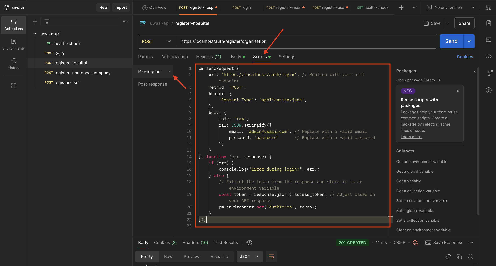

# Uwazi API

The Uwazi API helps hospital insurance providers verify if hospital insurance claims are valid or not.

---

## 1. Environment Setup

### Steps:
1. **Clone the Repository:**
   - get the github url of the repository by clicking on the code button and copy the url
   
   - Clone the branch to your local machine using the following command:
     ```bash
     git clone <github-url>
     ```

     

2. **Rename `.env.sample` to `.env`:**
   - Navigate to the root directory of the cloned repository.
   - Rename the file `.env.sample` to `.env`.

3. **Configure `.env` Variables:**
   - Open the `.env` file and configure the variables as per your environment.

---

### Explanation of `.env` Variables

#### General Configuration:
| Variable       | Description                                                             |
|----------------|-------------------------------------------------------------------------|
| `FLASK_APP`    | Entry point for the Flask application. Set to `start.py`.              |
| `FLASK_ENV`    | Flask environment. Use `development` for local development.            |
| `FLASK_PORT`   | Port where the Flask application will run. Default is `8080`.          |

#### Security Configuration:
| Variable       | Description                                                                 |
|----------------|-----------------------------------------------------------------------------|
| `SECRET_KEY`   | Secret key for securing sessions and other cryptographic uses. Use 32 bit string or use the default value in the sample file for local testing. |

#### Database Configuration:
| Variable          | Description                                             |
|-------------------|---------------------------------------------------------|
| `POSTGRES_HOST`   | Hostname for the PostgreSQL database. Default is `database`. |
| `POSTGRES_PORT`   | Port for the PostgreSQL database. Default is `5432`.    |
| `POSTGRES_DB`     | Name of the PostgreSQL database. Set to `uwazi_db`.     |
| `POSTGRES_USER`   | Username for the PostgreSQL database. Set to `uwazi_admin`. |
| `POSTGRES_PASSWORD` | Password for the PostgreSQL database. Set to `Today123%!`. |

#### Admin Configuration:
| Variable               | Description                                      |
|------------------------|--------------------------------------------------|
| `DEFAULT_ORG_NAME`     | Name of the default organization.                |
| `DEFAULT_ADMIN_EMAIL`  | Email address for the default admin user.        |
| `DEFAULT_ADMIN_PASSWORD` | Password for the default admin user.            |
| `DEFAULT_ADMIN_USERNAME` | Username for the default admin user.            |

#### Mail Configuration:
| Variable        | Description                                                                 |
|-----------------|-----------------------------------------------------------------------------|
| `MAIL_USERNAME` | gmail Username for the email account used for mailing.                           |
| `MAIL_PASSWORD` | gmail passkey for the email account used for mailing. Checkout the `Setting Up Mailing Configuration` section below                          |

---

### Setting Up Docker Desktop
1. **Install Docker Desktop:**
   - Download and install Docker Desktop from the [Docker website](https://www.docker.com/products/docker-desktop/).

2. **Start Docker Desktop:**
   - Open Docker Desktop and ensure it is running.

3. **Verify Installation:**
   - Run the following command to verify Docker is installed and running:
     ```bash
     docker --version
     ```

---

### Setting Up mkcert for HTTPS
1. **Install mkcert:**
   - Download and install `mkcert` from the [mkcert GitHub repository](https://github.com/FiloSottile/mkcert).

2. **Generate Localhost Certificates:**
   - Run the following commands to generate certificates:
     ```bash
     mkcert -install
     mkcert localhost
     ```

3. **Copy Certificates:**
   - Copy the generated `localhost-key.pem` and `localhost.pem` files to the `config/nginx/certs` directory.

4. **Test HTTPS Locally:**
   - Use `https://localhost/health` to test your application without specifying a port.
   This should return the following response:
   ```json
   {
      "status": "healthy"
   }
   ```

---

### Setting Up Mailing Configuration
1. **Generate App Password:**
   - Visit [Google App Passwords](https://security.google.com/settings/security/apppasswords).
   - Add a new app and copy the generated password, it should look something like this:

   
   

2. **Update `.env` File:**
   - Set `MAIL_USERNAME` to your email address.
   - Set `MAIL_PASSWORD` to the generated app password.

---


## 2. Running the Project

### Starting the Project with docker compose
---
1. **Build and Start Containers:**
   - Run the following command to build and start the project:
     ```bash
     docker-compose up --build
     ```

2. **Access the Application:**
   - Open your browser and navigate to `https://localhost/api/health` to verify the application is running.


### Application Entry Point
---
When the project starts up, the main project file is `start.py` and contains a reference to seed data, as shown below:

```python
class App:
    def __init__(self):
        # ...other code

        with self.app.app_context():
            # ...other code
            seed()

        # ...other code

app, debug_mode, flask_port = App().get()

app.run(host="0.0.0.0", port=flask_port, debug=debug_mode)
```

### Seed Function
---

The seed function is located in `config/database/seed.py` and initializes the following data:

- Default Uwazi user.
- Default roles.
- Default Uwazi organization.


The data seeded is defined in the `.env` or `.env.sample` file under the following variables:

| Variable                 | Description                               |
| ------------------------ | ----------------------------------------- |
| `DEFAULT_ORG_NAME`       | Name of the default organization.         |
| `DEFAULT_ADMIN_EMAIL`    | Email address for the default admin user. |
| `DEFAULT_ADMIN_PASSWORD` | Password for the default admin user.      |
| `DEFAULT_ADMIN_USERNAME` | Username for the default admin user.      |

---

## Using Postman to Test the API
---

1. **Setup Postman Environment:**
   - Download the postman collection form this link: [Uwazi API Postman Collection Link](./docs/postman/uwazi-api.postman_collection.json)

   - import the collection by clicking on the import button in postman
   

   - select the file you downloaded
   

   - Setup pre request scripts for routes that require authentication.
   

   then pre-request script is:
   ```javascript
      pm.sendRequest({
         url: 'https://localhost/auth/login', // Replace with your auth endpoint
         method: 'POST',
         header: {
            'Content-Type': 'application/json',
         },
         body: {
            mode: 'raw',
            raw: JSON.stringify({
                  email: 'admin@uwazi.com', 
                  password: 'password' 
            })
         }
      }, function (err, response) {
         if (err) {
            console.log('Error during login:', err);
         } else {
            // Extract the token from the response and store it in an environment variable
            const token = response.json().access_token; // Adjust based on your API response
            pm.environment.set('authToken', token);
         }
      });
   ```
   - Setup the authorization header for the use the `authToken` environment variable in postman
      

   - Repeat this for all the routes that require authentication in the postman collection

2. **Test Endpoints:**
   - Use the predefined endpoints to test the API functionalities. Examples include:
     


---

